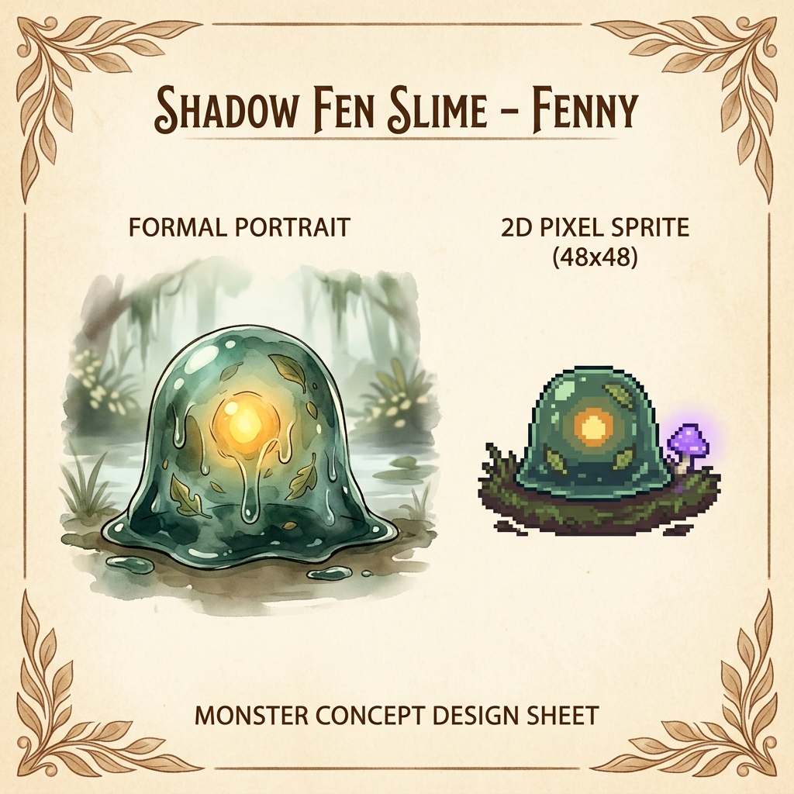
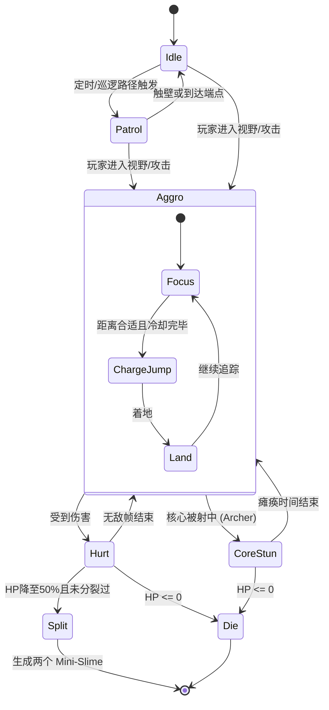

# 沼泽史莱姆（Shadow Fen Slime - Fenny）怪物设计文档

- **项目**：Hollowfen（2D 横版类银河战士恶魔城）
- **类型**：基础战斗与机制型敌人
- **设定**：在幽暗的沼泽深处游荡的半透明凝胶状生物。它们体内包裹着发光的古代魔力核心，以及在沼泽中吞噬的枯叶与杂质。
- **视觉风格参考**：
  

---

## 1. 视觉与美术设定

### 1.1 写实画幅（Formal Portrait）
* **身体质感**：半透明、深绿色至蓝绿色的半流体凝胶。边缘有水滴般莹润的光泽和流动感。
* **体内核心**：身体正中央悬浮着一颗散发温暖黄橙色光芒的球形核心。核心是史莱姆的生命源泉，也是唯一的实质弱点。
* **细节杂质**：胶体内部随机漂浮着一些沼泽的枯叶、细小的树枝和气泡，凸显其与沼泽环境的融合度。
* **动态表现**：静止时会有微弱的上下起伏和呼吸感，移动时呈波浪状挤压变形。

### 1.2 2D 像素精灵（2D Pixel Sprite - 48x48）
* **像素尺寸**：48x48 像素。
* **配色方案**：使用深绿、墨绿作为胶体主色，亮橙与明黄作为核心色，边缘使用偏冷色调的半透明高光。
* **环境细节**：在待机和移动时，底部会与潮湿的草皮或泥地产生挤压，并有微弱的胶体粘滞拉丝效果。

---

## 2. 玩法与战斗机制（结合角色瞬切玩法）

作为《Hollowfen》的基础怪物，芬尼（Fenny）的设计旨在强化**「近战（Knight）与远程（Archer）瞬切配合」**的核心乐趣。

### 2.1 核心双层碰撞判定（Double Hitbox/Hurtbox）
史莱姆拥有两个独立的受击盒（Hurtbox）：
1. **外层胶体 Hurtbox (Gelatinous Body)**
   * **区域**：占据整个史莱姆的身体。
   * **特性**：免疫普通弹射物（如 Archer 的箭矢直接射中外层会被弹开或伤害极低），但会被 Knight 的重击挥砍造成正常伤害。
   * **物理反馈**：受到 Knight 攻击时会产生明显的击退和剧烈的胶体抖动。
2. **核心弱点 Hurtbox (Core Weakness)**
   * **区域**：仅限于体内中央的发光核心。
   * **特性**：**核心受击点**。只有当 Archer 的箭矢精准贯穿外层胶体并击中核心时，才会触发**「致命一击（Critical Hit）」**。
   * **物理反馈**：核心被击中后，史莱姆会陷入短暂的**「瘫痪硬直（Core Exposed Stun）」**，此时外层胶体防御失效，Knight 的近战伤害翻倍。

### 2.2 行为模式（Behavior Patterns）
* **常态巡逻 (Patrolling)**：在特定平台上缓慢蠕动，遇到悬崖或墙壁时折返。
* **警觉与跃击 (Aggro & Pounce)**：
  * 当玩家进入其仇恨范围时，史莱姆的发光核心会剧烈闪烁。
  * 蓄力压缩身体，然后向玩家方向发起弧线跳跃撞击（Jump Attack）。
* **阶段分裂 (Splitting Mechanism)**：
  * 当史莱姆的生命值降低至 **50%** 以下时，它会触发分裂。
  * **分裂过程**：身体拉长、从中间断裂为两个更小的「微型史莱姆 (Mini Fenny)」。
  * **微型史莱姆特性**：没有核心（生命值很低，任意角色一击即死），但移动速度和跳跃频率大幅提升，试图干扰玩家。

---

## 3. 状态机设计（State Machine）

依据 Godot 4 的通用状态机模式设计：



### 状态详情
1. **Idle（待机）**：史莱姆原地呼吸，进行微弱的缩放动画。
2. **Patrol（巡逻）**：沿地面水平蠕动，速度较慢。
3. **Aggro - Focus（锁定）**：发现玩家，身体朝向玩家，核心高频闪烁。
4. **Aggro - ChargeJump（跃击）**：压缩至原来高度的 50%，然后猛烈弹起，向玩家砸去，跃击过程中具有接触伤害。
5. **Hurt（常规受伤）**：被 Knight 砍中，产生轻微硬直与后退，外胶体变红。
6. **CoreStun（核心瘫痪）**：被 Archer 射中核心，史莱姆瞬间失去弹性，瘫开在地上，核心熄灭呈灰色，持续 2-3 秒。
7. **Split（分裂状态）**：播放快速分裂动画，本体消失，在原位置生成两个 Mini-Slime。
8. **Die（死亡）**：半透明胶体炸开成一滩水花，核心碎裂消失，产生微弱的光尘粒子。

---

## 4. Godot 4 节点结构与参数设计

### 4.1 场景节点树（FennySlime.tscn）

```text
FennySlime (CharacterBody2D)          # 怪物根节点
 ├── AnimatedSprite2D                 # 2D 像素动画（支持半透明 shader）
 ├── CollisionShape2D (Capsule)       # 物理碰撞盒（防穿墙/掉落）
 ├── Health (Node)                    # 属性组件：控制 HP、防御、生命周期
 ├── StateMachine (Node)              # 状态机控制器
 │    ├── IdleState
 │    ├── PatrolState
 │    ├── AggroState
 │    ├── HurtState
 │    ├── CoreStunState
 │    └── SplitState
 ├── Hitbox (Area2D)                  # 接触伤害判定（攻击玩家）
 │    └── CollisionShape2D
 ├── Hurtbox_Body (Area2D)            # 胶体受击盒（玩家普通攻击判定）
 │    └── CollisionShape2D (大圆)
 └── Hurtbox_Core (Area2D)            # 核心受击盒（仅对 Archer 的箭矢生效）
      └── CollisionShape2D (小圆，位于身体中心)
```

### 4.2 基础数值属性（JSON/GDScript Exports）

```gdscript
# Fenny 的基础平衡数值
const MAX_HEALTH = 30.0
const PATROL_SPEED = 40.0
const CHASE_SPEED = 70.0
const JUMP_VELOCITY = -280.0
const CONTACT_DAMAGE = 10.0
const KNOCKBACK_RESISTANCE = 0.4  # 40% 击退抗性

# 核心瘫痪状态持续时间
const CORE_STUN_DURATION = 2.5
# 核心伤害倍率
const CORE_DAMAGE_MULTIPLIER = 2.5
```

---

## 5. 阶段 0 (垂直切片) 与阶段 2 (战斗深度) 的实现路线

1. **阶段 0（目前）**：
   * 将测试关卡中的红方块替换为 **FennySlime**。
   * 仅实现最简的 `Patrol` 状态、`Hurtbox_Body`（支持 Knight 近战攻击扣血）以及死亡消失。
   * 视觉上用半透明的绿色椭圆 + 中心的黄色小圆来简化表现。
2. **阶段 2（战斗深度）**：
   * 引入上述完整的像素美术贴图与动画。
   * 实现 `Hurtbox_Core`（核心精确受击）与 Archer 的箭矢穿透逻辑。
   * 实现核心瘫痪状态（`CoreStunState`）与分裂机制（`SplitState`）。
   * 增加受伤闪红/变白和粘液溅射粒子效果。
